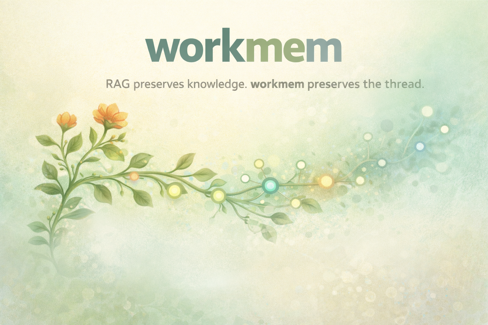

# workmem



**Working memory for AI reasoning.**

workmem is a local knowledge graph that keeps the thread between sessions. It stores facts, decays what stops mattering, and surfaces what still does. One binary, one SQLite file, any MCP client.

> The RAG preserves knowledge. workmem preserves the thread.

This is not an archive. It's the context that helps a model think *now*: recent decisions, open problems, corrections, preferences, relationship patterns. Things that keep coming back get reinforced. Things that don't, fade. That's the feature.

## Why this exists

LLMs forget everything between sessions. System prompts can't hold your project's history. RAG is great for reference material but bad for recency, continuity, and working context. workmem fills the gap: lightweight enough to call on every session start, smart enough to surface what's relevant without being asked.

## Install

### Homebrew (macOS / Linux)

```bash
brew tap marlian/tap
brew install workmem
```

The tap is published once the first tagged release exists; until then use one of the methods below.

### Direct download

Download the archive for your platform from [releases](https://github.com/marlian/workmem/releases) and extract. Each archive contains the `workmem` binary plus `LICENSE` and `README.md`:

```bash
# pick the archive that matches your OS/arch, e.g. darwin-arm64 / linux-amd64
VER=v0.1.0
curl -LO "https://github.com/marlian/workmem/releases/download/${VER}/workmem-darwin-arm64-${VER}.tar.gz"
tar -xzf workmem-darwin-arm64-${VER}.tar.gz
sudo install workmem-darwin-arm64-${VER}/workmem /usr/local/bin/workmem
workmem version
```

For integrity, download `SHA256SUMS` from the release page and verify before installing:

```bash
curl -LO "https://github.com/marlian/workmem/releases/download/${VER}/SHA256SUMS"
shasum -a 256 -c SHA256SUMS --ignore-missing
```

On macOS, Gatekeeper will warn on first launch of an unsigned binary downloaded this way. Remove the quarantine attribute with `xattr -d com.apple.quarantine /usr/local/bin/workmem`, or install via Homebrew (which does not trigger the warning).

### Build from source

```bash
git clone https://github.com/marlian/workmem.git
cd workmem
go build -o workmem ./cmd/workmem
./workmem version   # prints "workmem dev" without -ldflags
```

Or let Go fetch and install directly:

```bash
go install github.com/marlian/workmem/cmd/workmem@latest
```

Go 1.26+ is required (see `go.mod` for the exact minimum). No CGO, no runtime dependencies — the result is a single static binary. Source builds report `workmem dev` for version; tagged release binaries carry the real `vX.Y.Z` plus commit SHA and build timestamp.

## Client configuration

workmem speaks MCP over stdio. Add it to your client's config:

### Claude Code

```json
{
  "mcpServers": {
    "memory": {
      "command": "/path/to/workmem"
    }
  }
}
```

### Claude Desktop

```json
{
  "mcpServers": {
    "memory": {
      "command": "/path/to/workmem"
    }
  }
}
```

### VS Code / Cursor

`.vscode/mcp.json`:

```json
{
  "servers": {
    "memory": {
      "command": "/path/to/workmem"
    }
  }
}
```

### Any MCP client

```bash
/path/to/workmem
```

No arguments required. Configuration is optional via environment variables.

## How it works

### The decay model

Facts don't live forever. workmem implements cognitive decay inspired by how human memory works:

```
effective_confidence = confidence * 0.5 ^ (age_weeks / stability)
stability = half_life * (1 + log2(access_count + 1))
```

- A fact recalled 0 times has stability equal to the half-life (12 weeks default)
- A fact recalled 3 times has stability of 24 weeks
- A fact recalled 7 times has stability of 36 weeks
- Frequently recalled facts resist decay. Forgotten facts fade naturally.

Decay is computed at read time. No background jobs.

### Composite ranking

Seven search channels feed a composite relevance score:

| Channel | Weight | What it matches |
|---------|--------|----------------|
| `fts_phrase` | 1.15 | Adjacent terms in FTS |
| `fts` | 1.0 | Any term match in FTS |
| `entity_exact` | 0.9 | Exact entity name |
| `entity_like` | 0.7 | Fuzzy entity name |
| `content_like` | 0.5 | Substring in content |
| `type_like` | 0.45 | Entity type match |
| `event_label` | 0.4 | Event label match |

Final score blends relevance (70%) with decayed memory strength (30%), plus bonuses for FTS position and multi-channel hits.

### Project-scoped memory

```
remember({ entity: "API", observation: "rate limit 100/min", project: "~/my-app" })
```

Each project gets its own isolated SQLite database at `<project>/.memory/memory.db`, created lazily. Global memory (no `project` param) lives next to the binary.

## Tools

12 MCP tools. No more, no less.

| Tool | Purpose |
|------|---------|
| `remember` | Store a fact about an entity |
| `remember_batch` | Store multiple facts at once |
| `recall` | Search by free text (composite ranked) |
| `recall_entity` | Everything about one entity |
| `relate` | Link two entities |
| `forget` | Soft-delete a fact or entity |
| `list_entities` | Browse what's stored |
| `remember_event` | Group observations under a session/meeting/decision |
| `recall_events` | Search events by label, type, date |
| `recall_event` | Full event with all observations |
| `get_observations` | Fetch by ID (provenance) |
| `get_event_observations` | Fetch raw observations for an event |

### Compact recall

`recall` accepts `compact: true` to return truncated snippets instead of full content. Use `get_observations` to expand specific items. This keeps context windows lean.

## Environment variables

| Variable | Default | Description |
|----------|---------|-------------|
| `MEMORY_DB_PATH` | Next to binary | Path to the global SQLite database |
| `MEMORY_HALF_LIFE_WEEKS` | `12` | Decay half-life for global memory |
| `PROJECT_MEMORY_HALF_LIFE_WEEKS` | `52` | Decay half-life for project memory |
| `COMPACT_SNIPPET_LENGTH` | `120` | Max chars per observation in compact mode |

### Loading config from a .env file

Some MCP clients (e.g. Kilo, opencode-derivatives) ignore the `env` block in their server config — only `command` and `args` are portable. Use the `-env-file` flag to load variables from a file:

```
workmem -env-file /path/to/.env
```

The parser mirrors the reference Node loader: `KEY=value`, single/double quotes, `# comments`, `export KEY=value`, BOM, CRLF. No variable interpolation, no multi-line, no escape sequences. Missing file is not an error (silent fallback to defaults).

**Precedence:** explicit process env > `-env-file` values > built-in defaults. A key already present in the environment — even set to an empty string — is never overwritten by the file.

## Running multiple instances

A common pattern: one for general knowledge, one for private notes. The client sees them as separate tool namespaces:

```json
{
  "mcpServers": {
    "memory": {
      "command": "/path/to/workmem",
      "args": ["-env-file", "/path/to/memory/.env"]
    },
    "private_memory": {
      "command": "/path/to/workmem",
      "args": ["-env-file", "/path/to/private-memory/.env"]
    }
  }
}
```

Each `.env` holds that instance's `MEMORY_DB_PATH`, `MEMORY_HALF_LIFE_WEEKS`, and any other overrides — no duplication in the client config. For clients that support it, the `env` block still works and takes precedence over the file.

## Recommended LLM instructions

Add to your system prompt or `CLAUDE.md`:

```markdown
## Persistent Memory

You have access to a persistent memory store. Use it proactively:

- **`remember`** when you learn something worth retaining across sessions
- **`recall`** at session start or when you need context (it's free — local SQLite)
- **`remember_event`** to group related facts under a session or decision
- **`forget`** to remove stale or incorrect facts
- **`relate`** to link entities with named relationships

Remember: preferences, corrections, names, decisions, conventions.
Don't remember: transient tasks, code snippets, things already in docs/git.
```

## Database

SQLite with WAL mode. Tables: `entities`, `observations`, `relations`, `events`, `memory_fts` (FTS5). Schema created automatically. Soft-delete via `deleted_at` tombstones — forgotten facts are excluded from retrieval but remain in the database.

## Backup

Produce an end-to-end encrypted snapshot with the `backup` subcommand. The snapshot is taken via `VACUUM INTO` (consistent, no lock on the live DB) and encrypted with [age](https://age-encryption.org). The plaintext intermediate never leaves the temp directory; the output is written with `0600` permissions.

```bash
# single recipient
workmem backup --to backup.age --age-recipient age1yourpubkey...

# multiple recipients and/or a recipients file
workmem backup --to backup.age \
  --age-recipient age1alpha... \
  --age-recipient /path/to/recipients.txt
```

Restore with the standard age CLI:

```bash
age -d -i my-identity.txt backup.age > memory.db
```

Only the global memory DB is included. Project-scoped DBs live in their own workspaces and are out of scope. Telemetry data (if enabled) is operational and not included — rebuild freely.

## Design principles

- **Stupidity of use, solidity of backend.** The model doesn't think about memory. It just calls tools. The ranking, decay, and retrieval happen behind the curtain.
- **12 tools is the ceiling, not the floor.** Every tool costs context tokens on every model invocation. Adding tool 13 requires strong evidence.
- **Decay is the feature.** What matters keeps surfacing. What doesn't, fades. This isn't a compromise — it's the mechanism.
- **Evidence over intuition.** The next feature ships when data says it should, not when it sounds interesting.

## License

MIT — see [LICENSE](LICENSE) for the full text.
