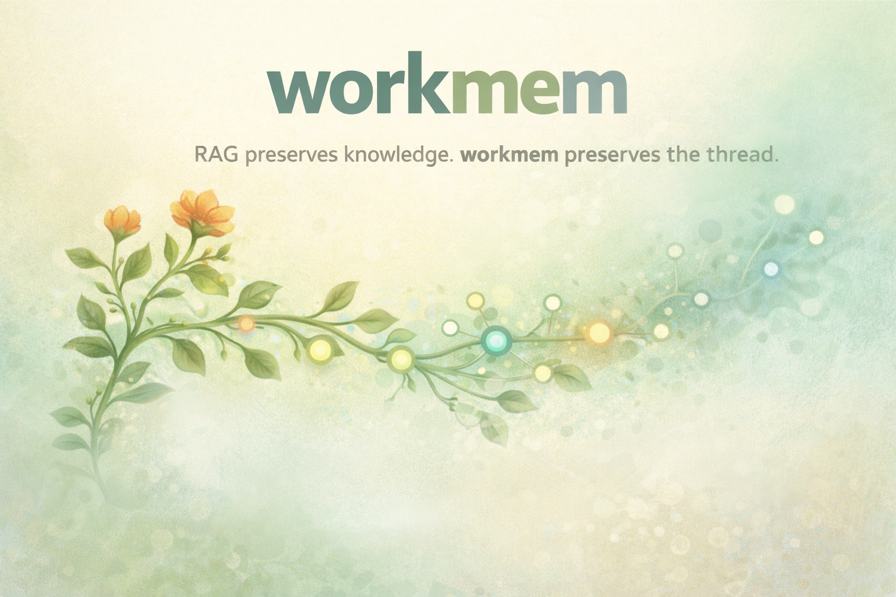

# workmem



**Working memory for AI reasoning.**

workmem is a local, persistent knowledge graph for MCP clients. It stores facts and ranks recall results using lexical relevance, age, confidence, and access history. One binary, a separate SQLite database per memory scope, any MCP client.

> The RAG preserves knowledge. workmem preserves the thread.

It is designed for working context rather than an exhaustive reference archive: decisions, open problems, corrections, preferences, and relationships. Decay reduces a fact's ranking contribution; it does not expire or delete the stored observation.

## Why this exists

workmem gives a client a place to keep selected facts outside the conversation window and retrieve them across sessions. The client or model decides when to call `remember` and `recall`. The server does not ingest transcripts, extract facts with an LLM, inject startup context, or run background consolidation on its own.

## Documentation

| Document | Purpose |
|----------|---------|
| [PITCH.md](PITCH.md) | Product vision and positioning |
| [ARCHITECTURE.md](ARCHITECTURE.md) | Current components, data flows, and boundaries |
| [API_CONTRACT.md](API_CONTRACT.md) | MCP and CLI behavior, inputs, and lifecycle rules |
| [OPERATIONS.md](OPERATIONS.md) | Operational invariants, verification commands, and active debt |
| [IMPLEMENTATION.md](IMPLEMENTATION.md) | Delivered steps and remaining work |
| [DECISION_LOG.md](DECISION_LOG.md) | Historical decisions and their rationale |

## Install

### Homebrew (macOS / Linux)

```bash
brew tap marlian/tap
brew install workmem
workmem version
```

Source: [marlian/homebrew-tap](https://github.com/marlian/homebrew-tap). Updates with `brew update && brew upgrade workmem`.

### Direct download

Download the archive for your platform from [releases](https://github.com/marlian/workmem/releases) and extract. Each archive contains the `workmem` binary plus `LICENSE` and `README.md`:

```bash
# pick the archive that matches your OS/arch, e.g. darwin-arm64 / linux-amd64
VER='<release-tag>' # replace with the tag from the chosen release
curl -LO "https://github.com/marlian/workmem/releases/download/${VER}/workmem-darwin-arm64-${VER}.tar.gz"
tar -xzf workmem-darwin-arm64-${VER}.tar.gz
sudo install workmem-darwin-arm64-${VER}/workmem /usr/local/bin/workmem
workmem version
```

For integrity, download `SHA256SUMS` from the release page and verify only the archive you actually fetched, using the checksum tool that ships with your platform:

```bash
curl -LO "https://github.com/marlian/workmem/releases/download/${VER}/SHA256SUMS"

# macOS
grep "workmem-darwin-arm64-${VER}" SHA256SUMS | shasum -a 256 -c

# Linux
grep "workmem-linux-amd64-${VER}" SHA256SUMS | sha256sum -c
```

On macOS, Gatekeeper will warn on first launch of an unsigned binary downloaded this way. Remove the quarantine attribute with `xattr -d com.apple.quarantine /usr/local/bin/workmem`, or install via Homebrew (which does not trigger the warning).

### Build from source

```bash
git clone https://github.com/marlian/workmem.git
cd workmem
go test ./...
go run ./cmd/workmem sqlite-canary
go build -o workmem ./cmd/workmem
./workmem version   # prints "workmem dev" without -ldflags
```

Or let Go fetch and install directly:

```bash
go install github.com/marlian/workmem/cmd/workmem@latest
```

Go 1.26+ is required (see `go.mod` for the exact minimum). No CGO and no external runtime dependencies — the result is a single self-contained binary. Source builds report `workmem dev` for version; tagged release binaries carry the real `vX.Y.Z` plus commit SHA and build timestamp.

## Client configuration

workmem speaks MCP over stdio. Add it to your client's config:

### Claude Code

```json
{
  "mcpServers": {
    "memory": {
      "command": "/path/to/workmem"
    }
  }
}
```

### Claude Desktop

```json
{
  "mcpServers": {
    "memory": {
      "command": "/path/to/workmem"
    }
  }
}
```

### VS Code / Cursor

`.vscode/mcp.json`:

```json
{
  "servers": {
    "memory": {
      "command": "/path/to/workmem"
    }
  }
}
```

### Any MCP client

```bash
/path/to/workmem
```

No arguments required. Configuration is optional via environment variables.

## How it works

### The decay model

Stored observations have no age-based deletion policy. Their effective confidence decays at read time using this formula:

```
effective_confidence = confidence * 0.5 ^ (age_weeks / stability)
stability = half_life * (1 + log2(access_count + 1))
```

- With the default global half-life of 12 weeks, a fact recalled 0 times has stability of 12 weeks
- A fact recalled 3 times has stability of 36 weeks
- A fact recalled 7 times has stability of 48 weeks
- Frequently recalled facts resist decay; project memory uses a separate default half-life of 52 weeks

Decay does not rewrite stored confidence or content, and no background job is required. Explicit lifecycle rules are separate: tombstones, supersession, and expired events hide observations from active-memory reads.

### Composite ranking

Recall is lexical, not embedding-based. Seven search channels feed a composite relevance score:

| Channel | Weight | What it matches |
|---------|--------|----------------|
| `fts_phrase` | 1.15 | Adjacent terms in FTS |
| `fts` | 1.0 | Any term match in FTS |
| `entity_exact` | 0.9 | Exact entity name |
| `entity_like` | 0.7 | Entity-name substring |
| `content_like` | 0.5 | Substring in content |
| `type_like` | 0.45 | Entity type match |
| `event_label` | 0.4 | Event label match |

FTS-position and multi-channel bonuses are added to lexical relevance first. The final score blends that relevance (70%) with decayed memory strength (30%). Embeddings are used only by the separate semantic reconcile report command, not by MCP recall.

### Project-scoped memory

```
remember({ entity: "API", observation: "rate limit 100/min", project: "~/my-app" })
```

Each project gets its own isolated SQLite database, created lazily. Relative project paths resolve from the user's home directory, not the server's working directory. Where that database lives is a per-instance choice, `MEMORY_PROJECT_MODE`:

| Mode | Project DB location | Notes |
|------|--------------------|-------|
| `legacy` (default) | `<project>/.memory/memory.db` | Memory travels with the directory; keep `.memory/` out of version control |
| `central` | `<MEMORY_PROJECTS_ROOT>/<id>/memory.db` | One private store per instance; the project directory is never written to |
| `disabled` | none | Any `project` argument is rejected; the instance is global-only |

In `central` mode `MEMORY_PROJECTS_ROOT` defaults to `<global DB file stem>-projects/` beside the instance's global DB (`/data/memory.db` → `/data/memory-projects/`), so two instances with different global DBs never share a default root. A `registry.db` in that root maps each canonical project path (absolute, symlinks resolved) to an opaque id such as `my-app-3f9c2a1b7e04`. The project directory must already exist: a mistyped path is an error, not a new store. Because the id is not derived from the path, a moved or renamed project keeps its memory after one registry update:

```
workmem project list   -env-file memory.env                            # id, path, size of every registered project
workmem project import -env-file memory.env -from old/memory.db -path ~/my-app   # copy an existing DB in
workmem project move   -env-file memory.env ~/old-location ~/my-app    # re-point a registry entry after a move
```

Pass the instance's `-env-file` so CLI commands find the same root as the server; do not export `MEMORY_DB_PATH` or `MEMORY_PROJECT_MODE` from a shell profile, because MCP servers launched from that shell inherit them and process environment wins over `-env-file` values. The default root follows the global DB file name, so renaming that file starts a new, empty root: set `MEMORY_PROJECTS_ROOT` explicitly when the layout should survive such changes. Relative paths in `project` commands resolve from the current directory. If a client already used the new path before `project move`, an empty store was registered there; `project move -replace-empty` archives it under `<root>/discarded/` and completes the move (it refuses if that store holds any memory).

`central` mode never reads a legacy `<project>/.memory/memory.db`, and it refuses to serve a project while one exists:

- unregistered project with a legacy DB: calls fail with a hint to run `workmem project import`;
- registered project that still has a legacy DB (for example a legacy session kept writing after the import): calls fail until the legacy `.memory/` directory is moved out of the project.

Stop sessions that use legacy mode for a project before importing it. This way there is always exactly one authoritative file. A missing `registry.db` next to existing stores is also an error rather than a fresh, empty registry.

Global memory (no `project` parameter) uses the server's `--db` path, then `MEMORY_DB_PATH`, then `memory.db` next to the binary. The default falls back to the working directory when running through `go run` or when the executable path cannot be resolved.

## Tools

The server currently exposes 12 MCP tools. Reconcile and backup are separate CLI commands, not additional MCP tools.

| Tool | Purpose |
|------|---------|
| `remember` | Store a fact about an entity |
| `remember_batch` | Store multiple facts at once |
| `recall` | Search by free text (composite ranked) |
| `recall_entity` | Active observations and live relations for one entity |
| `relate` | Link two entities |
| `forget` | Soft-delete a fact or entity |
| `list_entities` | Browse what's stored |
| `remember_event` | Group observations under a session/meeting/decision |
| `recall_events` | Search events by label, type, date |
| `recall_event` | An active event with its visible observations |
| `get_observations` | Fetch by ID (provenance) |
| `get_event_observations` | Fetch visible observations for an event without ranking |

Identical active observations reuse the existing ID and retain its original
metadata and event association. Supplying that observation to a new event does
not attach it to the new event. See the [duplicate-reuse contract](API_CONTRACT.md#duplicate-observation-reuse)
before relying on `remember_event` attachment counts.

### Compact recall

`recall` returns full observation content by default. With `compact: true`, it returns snippets of up to `COMPACT_SNIPPET_LENGTH` characters (120 by default), marking shortened observations with `truncated: true`. Use `get_observations` to fetch full content for selected IDs. This is per-observation truncation, not LLM summarization or a total response-token budget; direct ID reads still respect lifecycle visibility rules.

## Environment variables

| Variable | Default | Description |
|----------|---------|-------------|
| `MEMORY_DB_PATH` | Next to binary | Path to the global SQLite database |
| `MEMORY_HALF_LIFE_WEEKS` | `12` | Decay half-life for global memory |
| `PROJECT_MEMORY_HALF_LIFE_WEEKS` | `52` | Decay half-life for project memory |
| `COMPACT_SNIPPET_LENGTH` | `120` | Max chars per observation in compact mode |
| `PROJECT_DB_CACHE_MAX` | `16` | Target max cached project-scoped SQLite handles; active leases may temporarily exceed it |
| `MEMORY_PROJECT_MODE` | `legacy` | Project DB storage: `legacy`, `central`, or `disabled`. Unknown values stop startup |
| `MEMORY_PROJECTS_ROOT` | `<global DB dir>/<global DB stem>-projects` | Central project store root; must be absolute and is an error unless the mode is `central` |
| `WORKMEM_EMBEDDING_PROVIDER` | `none` | Semantic reconcile provider config: `none`, `openai-compatible`, `ollama`, or `openai` |
| `WORKMEM_EMBEDDING_BASE_URL` | unset | Embedding provider base URL for non-`none` providers |
| `WORKMEM_EMBEDDING_MODEL` | unset | Embedding model identifier for non-`none` providers |
| `WORKMEM_EMBEDDING_DIMENSIONS` | unset | Embedding vector dimensions for non-`none` providers |

Remote embedding opt-in is intentionally not an environment variable. Use the
`workmem reconcile semantic --allow-remote-embeddings` CLI flag for `openai` or
non-loopback endpoints.

### Loading config from a .env file

Some MCP clients (e.g. Kilo, opencode-derivatives) ignore the `env` block in their server config — only `command` and `args` are portable. Use the `-env-file` flag to load variables from a file:

```
workmem -env-file /path/to/.env
```

The parser implements the documented workmem `.env` grammar: `KEY=value`, single/double quotes, `# comments`, `export KEY=value`, BOM, CRLF. No variable interpolation, no multi-line, no escape sequences. For `serve` and the `project` commands, a missing or unreadable `-env-file` is an error: silently falling back to defaults could send an instance's memory to the wrong DB or project mode, or create a registry under the wrong root. Other commands warn and continue.

**Precedence:** explicit process env > `-env-file` values > built-in defaults. A key already present in the environment — even set to an empty string — is never overwritten by the file.

## Running multiple instances

A common pattern: one for general knowledge, one for private notes. The client sees them as separate tool namespaces:

```json
{
  "mcpServers": {
    "memory": {
      "command": "/path/to/workmem",
      "args": ["-env-file", "/path/to/memory/.env", "-db", "/path/to/memory/memory.db"]
    },
    "private_memory": {
      "command": "/path/to/workmem",
      "args": ["-env-file", "/path/to/private-memory/.env", "-db", "/path/to/private-memory/memory.db", "-project-mode", "disabled"]
    }
  }
}
```

Each `.env` holds that instance's `MEMORY_DB_PATH`, `MEMORY_HALF_LIFE_WEEKS`, and any other overrides — no duplication in the client config. For clients that support it, the `env` block still works and takes precedence over the file.

Keep each instance's identity in its client args: `-db` for the global DB and, for the private instance, `-project-mode disabled`. Args are explicit per server entry and win over the environment, while environment variables can be inherited from a shell profile (for example a `MEMORY_DB_PATH` or `MEMORY_PROJECT_MODE` exported for CLI work) and would otherwise override the `.env` file, sending private notes to another instance's DB. A typical split keeps project memory in the general instance and makes the private one global-only:

```
# memory/.env
MEMORY_DB_PATH=/path/to/memory/memory.db
MEMORY_PROJECT_MODE=central

# private-memory/.env  (plus "-project-mode", "disabled" in the client args)
MEMORY_DB_PATH=/path/to/private-memory/memory.db
MEMORY_PROJECT_MODE=disabled
```

## Recommended LLM instructions

Add to your system prompt or `CLAUDE.md`:

```markdown
## Persistent Memory

You have access to a persistent memory store. Use it proactively:

- **`remember`** when you learn something worth retaining across sessions
- **`recall`** at session start or when you need context (it's free — local SQLite)
- **`remember_event`** to group related facts under a session or decision
- **`forget`** to remove stale or incorrect facts
- **`relate`** to link entities with named relationships

If `remember` returns `possible_conflicts`, review those observations before
storing more related facts. Use `forget` with `observation_id` only when the old fact should
be hidden from active memory (soft deletion, not physical erasure).
`workmem reconcile --mode propose` can report exact duplicate
candidates; `workmem reconcile --mode apply` and `workmem reconcile rollback
<run_id>` provide audited reversible exact-duplicate supersession.

Remember: preferences, corrections, names, decisions, conventions.
Don't remember: transient tasks, code snippets, things already in docs/git.
```

## Database

SQLite with WAL mode. Tables include `entities`, `observations`, `relations`, `events`, reconcile audit tables, `observation_embeddings`, and `memory_fts` (FTS5). MCP startup initializes or migrates the schema; read-only reconcile inspection and semantic report mode do not. Soft-delete via `deleted_at` tombstones — forgotten facts are excluded from retrieval but remain in the database. Superseded observations are also excluded from active-memory reads while preserving auditability.

## Backup

Produce an age-encrypted snapshot with the `backup` subcommand. The snapshot is taken via SQLite `VACUUM INTO` and encrypted with [age](https://age-encryption.org). The plaintext intermediate is held in a temporary directory during the operation; the output is written with `0600` permissions. This encrypts the backup, not the live memory database.

```bash
# single recipient
workmem backup --to backup.age --age-recipient age1yourpubkey...

# multiple recipients and/or a recipients file
workmem backup --to backup.age \
  --age-recipient age1alpha... \
  --age-recipient /path/to/recipients.txt
```

Restore with the standard age CLI:

```bash
age -d -i my-identity.txt backup.age > memory.db
```

Each backup includes one database. By default it selects the global DB; use `--db` to select a project DB explicitly: `/path/to/project/.memory/memory.db` in legacy mode, or `<projects root>/<id>/memory.db` in central mode (`workmem project list` shows ids). It does not discover or bundle other project DBs, the central `registry.db`, or the separate telemetry DB; in central mode, back up the whole projects root to keep every project together with its registry.

## Reconcile runner

`workmem reconcile --mode propose` runs a read-only hygiene scan and writes a
local markdown report under `review/` by default. `--mode apply` reruns the same
deterministic exact-duplicate scan, validates each source/target pair in a short
transaction, supersedes duplicate sources, and records audit rows. Rollback uses
the recorded run ID:

```bash
workmem reconcile --mode propose
workmem reconcile --mode propose --scope project=/path/to/repo
workmem reconcile --mode propose --since 90d
workmem reconcile --mode propose --output /tmp/reconcile.md
workmem reconcile --mode apply
workmem reconcile rollback <run_id>
workmem reconcile semantic
workmem reconcile semantic --mode report \
  --embedding-provider openai-compatible \
  --embedding-base-url http://localhost:1234/v1 \
  --embedding-model local-embedding-model \
  --embedding-dimensions 768 \
  --max-embeddings-per-request 64 \
  --max-observations-per-entity 200 \
  --max-candidates-per-entity 100
```

The exact-duplicate commands (`--mode propose`, `--mode apply`, and `rollback`)
operate on identical observation content within the same entity. They do not
perform semantic matching, embedding lookup, or summarization. Propose
opens the memory database read-only and does not create missing global/project
DBs, apply supersession, mutate observations, or write audit rows. Apply and
rollback require an existing DB, write `reconcile_runs` / `reconcile_decisions`,
snapshot the duplicated content in the audit row, and fail rather than mutate if
audited source/target state no longer matches.
Because they are write commands, apply/rollback may run schema migrations on an
existing DB before the reconcile transaction begins; use propose for a strictly
read-only inspection.
Rollback must be run against the same scope as the original apply run; use
`--scope project=/path/to/repo` for project-scoped apply runs.
The `--since` window selects entities with recent observations; once an entity
is selected, older active source rows can still be reported when they duplicate a
newer active observation.

`workmem reconcile semantic --mode validate` validates embedding provider
configuration and exits without generating semantic candidates, making network
calls, opening a memory database, or mutating memory. Validate mode ignores
report-only flag values, so stale `--db`, `--output`, threshold, or scan-window
flags cannot accidentally make validation touch a DB.

`workmem reconcile semantic --mode report` opens an existing global or project DB,
embeds same-entity active observations through `openai-compatible` or `ollama`,
populates/reuses `observation_embeddings`, and writes a markdown report under
`review/` by default. Report mode excludes deleted, expired-event, and superseded
observations. It does not mutate observations, supersession fields, reconcile
audit rows, access counts, FTS state, or schema migrations; embedding-cache
writes are the only allowed persistence. Embedding requests are chunked by
`--max-embeddings-per-request`; per-entity comparison/output work is bounded by
`--max-observations-per-entity` and `--max-candidates-per-entity`, with limit
signals written to the report. Reports include bounded candidate snippets for
human review, candidate clusters, and manual decision checkboxes; they are
local/private markdown files. Semantic apply does not exist.

The default provider is `none`. Non-`none` providers require
`--embedding-base-url`, `--embedding-model`, and `--embedding-dimensions`.
`openai-compatible` and `ollama` are supported for report mode; `openai` config
can be validated but report mode rejects it. `openai` and endpoints whose host is
not literal `localhost` or a loopback IP require the explicit
`--allow-remote-embeddings` flag. Host aliases are not DNS-resolved for this
trust decision. Environment variables can set provider details, but remote opt-in
is intentionally CLI-only.

### Optional model-assisted cleanup proposal

Semantic reports are evidence, not executable plans. You may paste a report into
an LLM you trust to draft a human cleanup proposal, but `workmem` does not call
that model or apply its suggestions. Reports contain memory snippets; only send
them to providers you are comfortable sharing that local/private content with.

Use a provider and model of your choice. A useful prompt shape is:

```text
You are a conservative memory hygiene reviewer. Analyze this semantic reconcile
report as a human cleanup spec. Do not execute actions. Do not output tool calls.

Core rules:
1. First classify relationship_type, then suggest action.
2. Semantic similarity means relatedness, not duplication.
3. Preserve timeline facts: opened vs merged, draft vs implemented, phase N vs
   phase N+1, and different commits/dates are not duplicates by default.
4. A source may be forgotten only if a proposed new observation fully preserves
   every distinct fact visible in the snippets.
5. Large heterogeneous clusters must be split by subtheme, not consolidated.

Allowed relationship_type values:
- lifecycle_pair
- same_topic_distinct_facts
- possible_duplicate
- broad_topic_blob
- scope_mismatch
- insufficient_evidence

Allowed action values:
- keep_all
- draft_synthetic_keep_sources
- draft_synthetic_then_human_may_forget
- split_into_subthemes
- move_scope_review
- inspect_only

Return:
- threshold_assessment
- stable_prompt_invariants
- cluster_decisions as JSON
- self_critique
```

## Design principles

- **Simple tools, explicit responsibility.** The client chooses what to remember and when to recall. The backend owns ranking, decay, persistence, and lifecycle validation.
- **12 tools is the ceiling, not the floor.** Every tool costs context tokens on every model invocation. Adding tool 13 requires strong evidence.
- **Decay affects relevance, not retention.** Access history reinforces ranking without an automatic age-based deletion policy.
- **Semantic evidence is not write authority.** Similarity produces review candidates; automatic reconcile mutations require exact duplicates and an audited, validated apply path.
- **Evidence over intuition.** The next feature ships when data says it should, not when it sounds interesting.

## License

MIT — see [LICENSE](LICENSE) for the full text.
